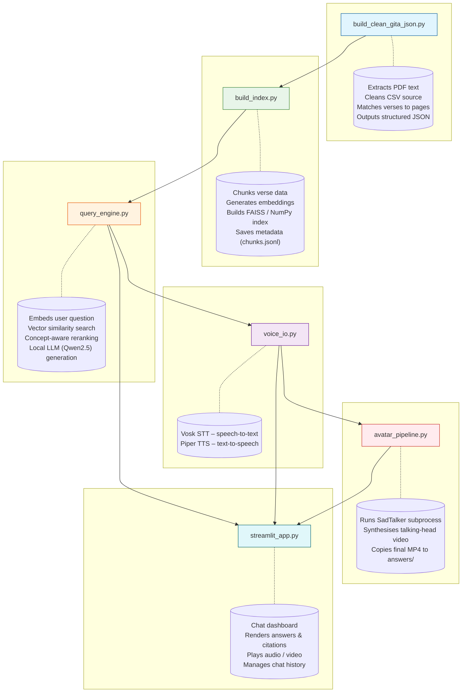
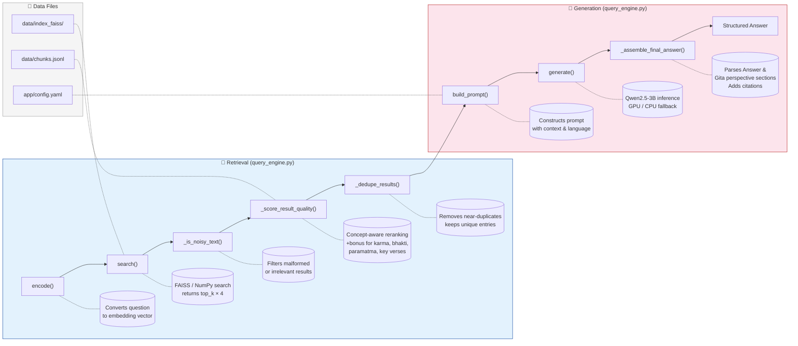

# Offline Gita Avatar Assistant — System Architecture

This document describes the end-to-end architecture of the **Offline Gita Avatar Assistant**, <mark> fully local, privacy-preserving Retrieval-Augmented Generation (RAG) system. It integrates document processing, semantic indexing, local LLM inference, speech I/O, and talking-head avatar generation into a single Streamlit dashboard</mark>.

<mark >style="background: #ff9999;" Take Note, in the current version the talking head avatar feature is not implemented </mark>

---

## Figure 1: Full System Architecture

*This diagram shows the complete pipeline—from raw PDF/CSV ingestion to the final user interface—with each major Python module annotated beside its data flow.*

# Brief Description — Figure 1

The architecture is split into six distinct stages, each handled by a dedicated Python module:

- **Data Preparation** (`build_clean_gita_json.py`): Extracts text from the source PDF, cleans the CSV data, matches verses to physical PDF pages, and builds a structured JSON corpus.

- **Indexing** (`build_index.py`): Chunks the corpus, generates dense embeddings using a SentenceTransformer model, and stores them in a FAISS/NumPy vector index alongside metadata.

- **Runtime Engine** (`query_engine.py`): The core RAG orchestrator—embeds user queries, performs vector search, applies concept-aware reranking, and generates answers via the local Qwen2.5-3B LLM.

- **Voice I/O** (`voice_io.py`): Handles microphone input using Vosk STT and produces synthesized speech using Piper TTS.

- **Avatar** (`avatar_pipeline.py`): Manages the SadTalker subprocess, feeding it the TTS audio and a source image to generate a talking-head video.

- **User Interface** (`streamlit_app.py`): Provides the interactive web dashboard, rendering answers with citations, playing audio/video, and persisting chat history.

All pipelines run fully offline, ensuring data privacy and low-latency operation without external API calls.

## Figure 2: Query & RAG Internal Flow

*This diagram dives into the query_engine.py module, illustrating the step-by-step retrieval and generation logic that transforms a user question into a structured answer with supporting citations.*

# Brief Description — Figure 2

This figure breaks down the RAG loop inside `query_engine.py` into two main phases: **Retrieval** and **Generation**.

## • Retrieval Phase:

- `encode()`: Converts the user question into a dense embedding.
- `search()`: Performs an initial semantic search over the FAISS/NumPy index, fetching a broad set of candidates (top_k × 4).
- `_is_noisy_text()`: Filters out malformed, irrelevant, or low-quality results.
- `_score_result_quality()`: Applies a custom reranking function that boosts scores for passages matching key theological concepts (e.g., *karma*, *bhakti*, *paramatma*) and specific high-relevance verses (e.g., 2.47, 18.66).
- `_dedupe_results()`: Removes near-duplicate entries to ensure diverse supporting evidence.

## • Generation Phase:

- `build_prompt()`: Formats the selected context and language settings into a structured instruction prompt.
- `generate()`: Runs inference on the local Qwen2.5-3B model (with GPU/CPU fallback).
- `_assemble_final_answer()`: Parses the LLM output to extract the "Answer" and "Gita perspective" sections, then appends verse citations.
- The final output is a **Structured Answer** ready for display, TTS synthesis, and avatar generation.

The diagram also shows the supporting data files (index_faiss/, chunks.jsonl, and config.yaml) that feed into the retrieval and prompt-building stages.

---

