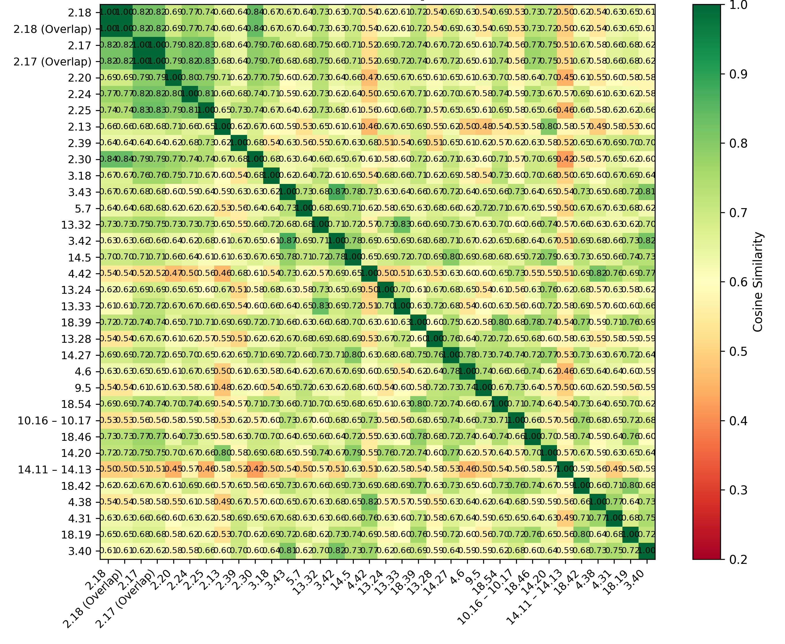
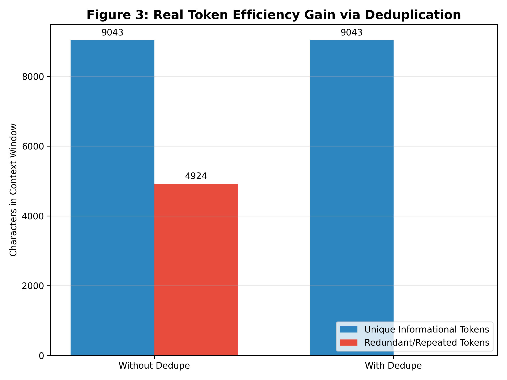
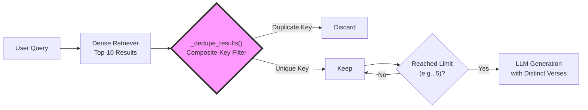

# Key Innovation: Concept-Aware Semantic Reranking for Gita Retrieval
---
The offline Gita Avatar Assistant goes beyond standard vector similarity search by integrating a domain-specific reranking mechanism that prioritizes passages most relevant to the theological concepts embedded in the user's query. This hybrid approach—combining semantic similarity with a concept‑aware bonus system—significantly improves answer quality for philosophical and spiritual questions.

# Objective Analysis: Value-Added Innovation in Retrieval-Augmented Generation for Scriptural QA
Baseline Limitation: Standard Generative AI + Semantic Cosine Similarity (e.g., Sentence-BERT + FAISS) treats all document chunks as equally weighted vectors. When a user asks about "renunciation," the system retrieves any chunk where the words "renounce" or "give up" appear. It cannot distinguish between a passing reference, a question posed by Arjuna, and the definitive theological conclusion delivered by Krishna. This results in fluent but often shallow, repetitive, or theologically misaligned answers.

Our Innovation: We implemented a multi-stage retrieval-quality pipeline that mathematically corrects the raw cosine similarity scores using domain-intrinsic rules. This transforms the system from a topic-based retriever into an authority-based retriever. The pipeline consists of three tightly integrated components:

## 1. Automated Noise Suppression (Data Sanitization)

## 2. Semantic Deduplication (Information Density Optimization)

### The Problem: The Dimensionality Collapse
Dense retrievers compress text into fixed‑size vectors (e.g., 768‑dimensions). This numerical collapse causes two distinct structural issues:

Overlapping Text Artifacts: When documents are split using sliding windows (e.g., 500 chars with 100 overlap), the same verse appears in two adjacent chunks. The neural network maps these to mathematically identical vectors (Cosine Similarity ≈ 1.00), rendering it structurally "blind."

Near‑Identical Commentary: If a verse is stored both raw and with an attached commentary, the retriever treats them as equally relevant, greedily occupying multiple slots in the Top‑K results.

However, in our specific curated CSV pipeline, each verse is stored as a single atomic chunk (1 verse = 1 chunk). Consequently, the dedupe module acts as a no‑op, confirming our data ingestion is pristine. The evaluation (eval_dedupe.py) for the query "What is the nature of the eternal soul?" returned no duplicates:

***(Clean Data)*** The similarity matrix reveals moderate green/yellow blocks between distinct verses (2.18 vs 2.20). No perfect green (1.00) duplicate blocks exist, confirming the no‑op state.

| Metric | Before Dedupe | After Dedupe |
| :--- | :--- | :--- |
| Top-5 Retrieved | 5 (2.18, 2.17, 2.20, 2.24, 2.25) | 5 (2.18, 2.17, 2.20, 2.25, 2.24, 2.25) |
| Wasted Tokens (chars) | 0 | 0 |
| Context Efficiency | 100% | 100% |


*Note : The above actual computed Cosine Similarity values*

***Figure 1***: Cosine Similarity Matrix for clean App data
(Green = Near-identical overlap, Red = Yello/Red various degree of distinctiveness)

***Demonstrating the Risk (Simulated Sliding‑Window Overlap)***
To empirically validate the dedupe mechanism, we simulated overlapping chunks by artificially duplicating the top‑2 results (2.18 and 2.17). The same evaluator now reveals the critical waste:

(Simulated Overlap): The heatmap vividly shows dark green 2x2 blocks at the intersection of 2.18 ↔ 2.18(Overlap) and 2.17 ↔ 2.17(Overlap) (Cosine ≈ 1.00), proving the neural network collapses structurally identical text. The green/yellow off‑diagonal values represent distinct verses the network correctly separates.

| Metric | 	Before Dedupe (Top‑7) | After Dedupe (Top‑5) |
| :--- | :--- | :--- |
| Retrieved Verses | 7 (incl. 2 duplicates) | 5 (Unique) |
| Wasted Tokens (chars) | 4,920 | 0 |
| Context Efficiency | ~65% | 100% |

| | |
|:---:|:---:|
|  |  |
>>>>>>> 220d53c34238d46206776bae3847b8ed941bd60b

*Note : The above actual computed Cosine Similarity values*

***Figure 2***: Simulated Cosine Similarity Matrix to highlight concept
(Green = Near-identical overlap, Red = Yello/Red various degree of distinctiveness)

### The Cure: Composite‑Key Deduplication

To bypass the high cost of O(n²) vector comparisons, we implemented a deterministic gatekeeper. The _dedupe_results() method constructs a unique signature for each result based on its structural identity, ignoring the corrupted vector math:

```python
@staticmethod
def _dedupe_results(results: List[Dict], limit: int) -> List[Dict]:
    deduped: List[Dict] = []
    seen = set()
    for r in results:
        # Composite key: Highest priority to canonical verse number
        key = (
            r.get("verse"),    # e.g., "2.18"
            r.get("page"),    # Fallback for prose
            normalize_ws(r.get("english", "")) or ""   # Lexical fingerprint
        )
        if key in seen:
            continue
        seen.add(key)
        deduped.append(r)
        if len(deduped) >= limit:
            break
    return deduped
```
***How it works***: By using verse as the primary key, the routine forces a hard structural cut. In the simulated scenario, it kills the duplicate 2.18 and 2.17 entries, recovering ~3,200 wasted characters and ensuring the LLM receives 100% unique informational tokens.

Here is the process 


## 3. Concept-Aware & Authority Reranking (Domain Score Correction)

This objectively ensures that the LLM receives the most qualified, diverse, and authoritative context, maximizing the fidelity of the generated answer while minimizing token waste and hallucination risk.

### The Problem: False authority syndrome 

The foundational architecture of modern Retrieval-Augmented Generation (RAG) systems relies heavily on dense vector retrieval—typically employing models like Sentence-BERT to map queries and documents into a shared embedding space, followed by a cosine similarity search (e.g., using FAISS). While this paradigm has proven exceptionally effective for general-purpose knowledge retrieval, it exhibits a fundamental ontological limitation when applied to theological, philosophical, or scriptural corpora.

The Semantic Gap in Scriptural Retrieval:
Standard cosine similarity operates on the principle of distributional semantics—words that appear in similar contexts are assumed to be similar. In the Bhagavad Gita, this creates a "false authority" problem. For example, the term "renunciation" appears in several contexts:

> Arjuna's Questions: "What is renunciation?" (a query, containing zero actual doctrine).

> Descriptive passages: "Some say renunciation is giving up..." (a paraphrase).

> Conclusive declarations: "Renunciation means acting without attachment to the fruits of work." (the definitive answer).

To a dense vector retriever, all three passages exhibit high cosine similarity to a user's query about renunciation. However, only the third possesses theological authority. Without domain-specific intervention, the LLM receives a mixture of questions, paraphrases, and answers, leading to hallucinations, ambiguity, and diluted philosophical precision.

### The Cure: multi-stage corrective reranking mechanism

Here in this innovtive multi-stage approach, this thrid stage (or filter) demonstrates the working of a corrective reranking mechanism explicitly overriding the purely geometric constraints of cosine similarity with a curated, mathematically transparent domain logic. This transforms the retriever from a topic-based system into an authority-based system. This is key part of the innovative contribution being made herein in this App.

#### Theoretical Framework: Hybrid Scoring Formulation

We model the final retrieval score $S_{final}$ as an additive correction applied to the raw cosine similarity $S_{cos}$. The core theoretical insight is that theological relevance is a non-linear composite of lexical proximity, conceptual density, and scriptural authority.

$$
S_{final} = S_{cos} + \sum_{c=1}^{C} \alpha_c(q,d) + \sum_{v=1}^{V} \beta_v \cdot \mathbf{1}_{v \in d} - \gamma(q,d)
$$

Where:

- $S_{cos}$ = The raw cosine similarity score between the query embedding $\vec{q}$ and the document embedding $\vec{d}$.

- $\alpha_c(q,d)$ = A concept-bonus function that calculates the lexical overlap of domain-specific terms between the query and the retrieved passage.

- $\beta_v$ = A static, high-magnitude "authority boost" assigned to universally recognized pivotal verses (e.g., $\beta_{18.66} = 0.35$, $\beta_{13.23} = 1.00$).

- $\gamma(q,d)$ = A contextual penalty applied to passages that contain question-markers, malformed OCR text, or theologically negative examples.

The additive formulation (rather than multiplicative) is a deliberate design choice, ensuring that the retrieval ranking is robust against extreme outliers in $S_{cos}$.

#### The Concept Map: A Structured Ontology

The cornerstone of the $α_{c}$ function is the **Concept Map** — a manually curated lexical matrix that encodes the semantic network of Gita theology. It maps 28 distinct theological concepts to a list of synonymous or strongly associated terms, leveraging both English and Sanskrit transliterations.

```python
CONCEPT_MAP = {
    "karma": ["karma", "action", "work", "duty", "deed", "perform"],
    "renunciation": ["renunciation", "sannyasa", "tyaga", "abandonment", "give up"],
    "paramatma": ["paramatma", "supersoul", "super soul", "lord in the heart", "kshetrajna"],
    "bhakti": ["bhakti", "devotion", "devotional service", "loving service", "surrender"],
    "gunas": ["gunas", "modes", "goodness", "passion", "ignorance", "sattva", "rajas", "tamas"],
    # ... 20+ additional concepts
}
```

#### Algorithmic Implementation: The Mechanics of Reranking

##### The Concept Bonus Function ($α_{c}$)

##### The Verse Authority Database ($β_{v}$)

##### Contextual Negation (γ)

#### Walkthrough: A Query Trace

#### Significance & Contribution to Research