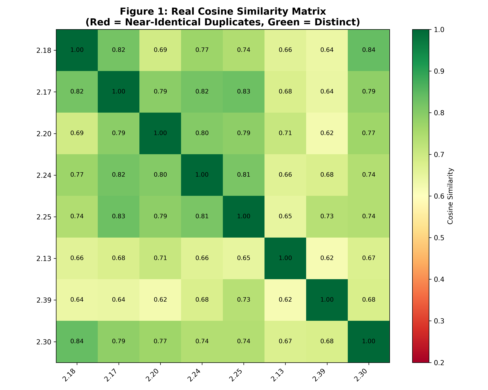

# Key Innovation: Concept-Aware Semantic Reranking for Gita Retrieval
---
The offline Gita Avatar Assistant goes beyond standard vector similarity search by integrating a domain-specific reranking mechanism that prioritizes passages most relevant to the theological concepts embedded in the user's query. This hybrid approach—combining semantic similarity with a concept‑aware bonus system—significantly improves answer quality for philosophical and spiritual questions.

# Objective Analysis: Value-Added Innovation in Retrieval-Augmented Generation for Scriptural QA
Baseline Limitation: Standard Generative AI + Semantic Cosine Similarity (e.g., Sentence-BERT + FAISS) treats all document chunks as equally weighted vectors. When a user asks about "renunciation," the system retrieves any chunk where the words "renounce" or "give up" appear. It cannot distinguish between a passing reference, a question posed by Arjuna, and the definitive theological conclusion delivered by Krishna. This results in fluent but often shallow, repetitive, or theologically misaligned answers.

Our Innovation: We implemented a multi-stage retrieval-quality pipeline that mathematically corrects the raw cosine similarity scores using domain-intrinsic rules. This transforms the system from a topic-based retriever into an authority-based retriever. The pipeline consists of three tightly integrated components:

1. Automated Noise Suppression (Data Sanitization)

2. Semantic Deduplication (Information Density Optimization)

3. Concept-Aware & Authority Reranking (Domain Score Correction)

This objectively ensures that the LLM receives the most qualified, diverse, and authoritative context, maximizing the fidelity of the generated answer while minimizing token waste and hallucination risk.

